# Database Schema

Database design for the Secure Social Networking and Digital Matchmaking Platform. This file describes Phase 2. The migrations in `backend/src/db/migrations` are the source of truth.

## 1. Database type

The schema is written with the Knex schema builder, so the same migrations run on every supported engine.

| Engine     | Minimum version | `DB_CLIENT` | Validated on |
| ---------- | --------------- | ----------- | ------------ |
| PostgreSQL | 12              | `postgres`  | PostgreSQL 18 |
| MySQL      | 8.0.16 (enforced CHECK constraints) | `mysql` | — (not tested) |
| MariaDB    | 10.4            | `mysql`     | MariaDB 10.4.32 |

**PostgreSQL is the default and recommended engine.** It has native `JSONB` and `TIMESTAMPTZ`, and enforces CHECK constraints on every version.

Type mapping used by the migrations:

| Logical type | PostgreSQL | MySQL / MariaDB |
| --- | --- | --- |
| Surrogate id | `BIGSERIAL` (`hobbies`: `SERIAL`) | `BIGINT UNSIGNED AUTO_INCREMENT` (`hobbies`: `INT UNSIGNED`) |
| Timestamp | `TIMESTAMPTZ` | `DATETIME`, stored in UTC (the connection sets `time_zone = '+00:00'`) |
| JSON | `JSONB` | `JSON` (MariaDB stores it as `LONGTEXT` with a `JSON_VALID` check) |
| Enum-like value | `VARCHAR` + `CHECK (col IN (...))` | same |

## 2. ER diagram

```mermaid
erDiagram
    users ||--o| profiles : "has"
    users ||--o| preferences : "has"
    users ||--o{ user_hobbies : "has"
    hobbies ||--o{ user_hobbies : "assigned in"
    users ||--o{ quiz_answers : "answers"
    users ||--o{ matches : "user1 (viewer)"
    users ||--o{ matches : "user2 (candidate)"
    users ||--o{ connection_requests : "sends"
    users ||--o{ connection_requests : "receives"
    users ||--o{ messages : "sends"
    users ||--o{ messages : "receives"
    users ||--o{ reports : "files"
    users ||--o{ reports : "is reported"
    users |o--o{ reports : "reviews (admin)"
    users ||--o{ blocks : "blocks"
    users ||--o{ blocks : "is blocked"
    users ||--o{ activity_feedback : "acts"
    users |o--o{ activity_feedback : "is target"
    users ||--o{ login_verifications : "verifies"

    users {
        bigint user_id PK
        varchar email UK "nullable, lower-case"
        varchar mobile UK "nullable"
        varchar password_hash "nullable, hash only"
        varchar role "user | admin"
        varchar status
        timestamptz email_verified_at
        timestamptz mobile_verified_at
        timestamptz last_login_at
        timestamptz created_at
        timestamptz updated_at
    }
    profiles {
        bigint user_id PK, FK
        varchar name
        date date_of_birth
        varchar gender
        varchar city
        varchar state
        varchar country
        varchar education
        varchar occupation
        varchar lifestyle
        text bio
        varchar profile_photo_url
        timestamptz created_at
        timestamptz updated_at
    }
    preferences {
        bigint user_id PK, FK
        varchar food_preference
        varchar lifestyle_preference
        varchar preferred_location
        smallint partner_min_age
        smallint partner_max_age
        jsonb partner_preferences
        timestamptz created_at
        timestamptz updated_at
    }
    hobbies {
        int hobby_id PK
        varchar hobby_name UK
        varchar status "active | inactive"
        timestamptz created_at
        timestamptz updated_at
    }
    user_hobbies {
        bigint user_id PK, FK
        int hobby_id PK, FK
        timestamptz created_at
    }
    quiz_answers {
        bigint id PK
        bigint user_id FK
        varchar question_id
        text answer
        timestamptz created_at
        timestamptz updated_at
    }
    matches {
        bigint match_id PK
        bigint user1_id FK
        bigint user2_id FK
        decimal score "0-100"
        jsonb score_breakdown
        timestamptz created_at
        timestamptz updated_at
    }
    connection_requests {
        bigint request_id PK
        bigint sender_id FK
        bigint receiver_id FK
        varchar status "pending | accepted | rejected"
        timestamptz created_at
        timestamptz updated_at
    }
    messages {
        bigint message_id PK
        bigint sender_id FK
        bigint receiver_id FK
        text message
        timestamptz sent_at
        timestamptz read_at
    }
    reports {
        bigint report_id PK
        bigint reporter_id FK
        bigint reported_id FK
        text reason
        varchar status
        bigint reviewed_by FK "nullable, admin"
        timestamptz reviewed_at
        timestamptz created_at
        timestamptz updated_at
    }
    blocks {
        bigint block_id PK
        bigint blocker_id FK
        bigint blocked_id FK
        timestamptz created_at
    }
    activity_feedback {
        bigint id PK
        bigint user_id FK
        bigint target_user_id FK "nullable"
        varchar action
        text reason
        timestamptz created_at
    }
    login_verifications {
        bigint verification_id PK
        bigint user_id FK
        varchar verification_status
        jsonb detection_result
        int attempt_count
        timestamptz attempted_at
        timestamptz verified_at
        timestamptz created_at
    }
```



## 3. Relationships

| Relationship | Cardinality | Implemented by |
| --- | --- | --- |
| users → profiles | 1 : 0..1 | `profiles.user_id` is both the PK and the FK |
| users → preferences | 1 : 0..1 | `preferences.user_id` is both the PK and the FK |
| users ↔ hobbies | M : N | `user_hobbies` (composite PK) |
| users → quiz_answers | 1 : N | `quiz_answers.user_id` |
| users → matches | 1 : N (twice) | `user1_id` (viewer), `user2_id` (candidate) |
| users → connection_requests | 1 : N (twice) | `sender_id`, `receiver_id` |
| users → messages | 1 : N (twice) | `sender_id`, `receiver_id` |
| users → reports | 1 : N (three times) | `reporter_id`, `reported_id`, `reviewed_by` |
| users → blocks | 1 : N (twice) | `blocker_id`, `blocked_id` |
| users → activity_feedback | 1 : N (twice) | `user_id`, `target_user_id` (nullable) |
| users → login_verifications | 1 : N | `login_verifications.user_id` |

Profiles and preferences are optional (0..1) because a user row is created at registration, before the profile is completed.

## 4. Tables

Every table has `created_at` with a `CURRENT_TIMESTAMP` default. Tables whose rows are edited also have `updated_at`. The database keeps `updated_at` current itself: a `BEFORE UPDATE` trigger on PostgreSQL (`set_updated_at()`), and `ON UPDATE CURRENT_TIMESTAMP` on MySQL. Append-only tables (`user_hobbies`, `messages`, `blocks`, `activity_feedback`, `login_verifications`) have no `updated_at`.

### 4.1 users

Account identity and state. Profile data lives in `profiles`.

| Column | Type | Null | Default | Notes |
| --- | --- | --- | --- | --- |
| user_id | bigint | no | auto | **PK** |
| email | varchar(255) | yes | | **UNIQUE**; stored lower-case |
| mobile | varchar(20) | yes | | **UNIQUE**; E.164 format expected (e.g. `+919876543210`) |
| password_hash | varchar(255) | yes | | Hash only (bcrypt/argon2, Phase 3). NULL for OTP-only accounts |
| role | varchar(20) | no | `user` | `user` \| `admin`. Lets the same table back both panels |
| status | varchar(30) | no | `pending_verification` | `pending_verification` \| `active` \| `suspended` \| `banned` \| `deactivated` \| `deleted` |
| email_verified_at | timestamp | yes | | Set after email OTP succeeds |
| mobile_verified_at | timestamp | yes | | Set after mobile OTP succeeds |
| last_login_at | timestamp | yes | | |
| created_at / updated_at | timestamp | no | now | |

Constraints:
- `chk_users_email_or_mobile`: at least one of `email` and `mobile` is required.
- `chk_users_email_lowercase`: `email = LOWER(email)`.
- `chk_users_role` and `chk_users_status`: allowed values only.

### 4.2 profiles

Public profile, 1:1 with `users`.

| Column | Type | Null | Notes |
| --- | --- | --- | --- |
| user_id | bigint | no | **PK**, **FK** → users.user_id (CASCADE) |
| name | varchar(100) | no | Must not be empty |
| date_of_birth | date | yes | Age is calculated from this (see design decisions) |
| gender | varchar(30) | yes | |
| city / state / country | varchar(100) | yes | Location split into parts so the matching engine can filter by it |
| education | varchar(150) | yes | |
| occupation | varchar(150) | yes | |
| lifestyle | varchar(100) | yes | |
| bio | text | yes | 2000 characters at most |
| profile_photo_url | varchar(512) | yes | Display picture from gallery, upload or camera. **Not related to login verification.** |
| created_at / updated_at | timestamp | no | |

### 4.3 preferences

The user's own food and lifestyle choices, plus what they want in a partner. 1:1 with `users`.

| Column | Type | Null | Notes |
| --- | --- | --- | --- |
| user_id | bigint | no | **PK**, **FK** → users.user_id (CASCADE) |
| food_preference | varchar(50) | yes | e.g. `vegetarian`, `vegan`, `non_vegetarian` |
| lifestyle_preference | varchar(100) | yes | |
| preferred_location | varchar(150) | yes | |
| partner_min_age | smallint | yes | At least 18 |
| partner_max_age | smallint | yes | At most 120 |
| partner_preferences | json/jsonb | yes | Open structure, e.g. `{"genders":[...],"education":[...],"occupation":[...]}` |
| created_at / updated_at | timestamp | no | |

Constraint `chk_preferences_age_range`: `partner_min_age <= partner_max_age` when both are set.

### 4.4 hobbies

Master list of hobbies and interests, maintained by admins.

| Column | Type | Null | Default | Notes |
| --- | --- | --- | --- | --- |
| hobby_id | int | no | auto | **PK** |
| hobby_name | varchar(100) | no | | **UNIQUE**, not empty |
| status | varchar(20) | no | `active` | `active` \| `inactive` |
| created_at / updated_at | timestamp | no | now | |

### 4.5 user_hobbies

Many-to-many link between users and hobbies.

| Column | Type | Null | Notes |
| --- | --- | --- | --- |
| user_id | bigint | no | **PK (part)**, **FK** → users.user_id (CASCADE) |
| hobby_id | int | no | **PK (part)**, **FK** → hobbies.hobby_id (RESTRICT) |
| created_at | timestamp | no | |

The composite PK `(user_id, hobby_id)` prevents the same hobby being assigned to a user twice.

### 4.6 quiz_answers (optional feature)

| Column | Type | Null | Notes |
| --- | --- | --- | --- |
| id | bigint | no | **PK** |
| user_id | bigint | no | **FK** → users.user_id (CASCADE) |
| question_id | varchar(64) | no | Stable key of a question defined by the quiz module |
| answer | text | no | |
| created_at / updated_at | timestamp | no | |

`UNIQUE (user_id, question_id)` allows one answer per question per user.

### 4.7 matches

Compatibility results written by the matching engine. The schema contains no scores; the engine writes them later.

| Column | Type | Null | Notes |
| --- | --- | --- | --- |
| match_id | bigint | no | **PK** |
| user1_id | bigint | no | **FK** → users (RESTRICT). The user the score is computed *for* |
| user2_id | bigint | no | **FK** → users (RESTRICT). The candidate |
| score | decimal(5,2) | no | 0–100 |
| score_breakdown | json/jsonb | yes | Per-attribute scores: location, education, occupation, hobbies, lifestyle, food, … |
| created_at / updated_at | timestamp | no | `updated_at` changes when the score is recalculated |

Constraints:
- `chk_matches_not_self`: `user1_id <> user2_id`.
- `chk_matches_score_range`: score is between 0 and 100.
- `UNIQUE (user1_id, user2_id)`.

### 4.8 connection_requests

| Column | Type | Null | Default | Notes |
| --- | --- | --- | --- | --- |
| request_id | bigint | no | auto | **PK** |
| sender_id | bigint | no | | **FK** → users (RESTRICT) |
| receiver_id | bigint | no | | **FK** → users (RESTRICT) |
| status | varchar(20) | no | `pending` | `pending` \| `accepted` \| `rejected` |
| created_at / updated_at | timestamp | no | now | |

Constraints:
- `chk_connection_requests_not_self`: a user cannot send a request to themselves.
- `UNIQUE (sender_id, receiver_id)`.

### 4.9 messages

Private one-to-one messages. The specification's `timestamp` field is named `sent_at`, because `timestamp` is a type keyword in SQL.

| Column | Type | Null | Default | Notes |
| --- | --- | --- | --- | --- |
| message_id | bigint | no | auto | **PK**; breaks ties when ordering |
| sender_id | bigint | no | | **FK** → users (RESTRICT) |
| receiver_id | bigint | no | | **FK** → users (RESTRICT) |
| message | text | no | | Must not be empty |
| sent_at | timestamp | no | now | |
| read_at | timestamp | yes | | For unread counts |

Constraints:
- `chk_messages_not_self`.
- `chk_messages_not_empty`.

### 4.10 reports

User reports, reviewed in the Admin Panel.

| Column | Type | Null | Default | Notes |
| --- | --- | --- | --- | --- |
| report_id | bigint | no | auto | **PK** |
| reporter_id | bigint | no | | **FK** → users (RESTRICT) |
| reported_id | bigint | no | | **FK** → users (RESTRICT) |
| reason | text | no | | Must not be empty |
| status | varchar(20) | no | `pending` | `pending` \| `under_review` \| `resolved` \| `dismissed` |
| reviewed_by | bigint | yes | | **FK** → users (SET NULL); the admin who handled the report |
| reviewed_at | timestamp | yes | | |
| created_at / updated_at | timestamp | no | now | |

Constraint `chk_reports_not_self`: a user cannot report themselves.

### 4.11 blocks

| Column | Type | Null | Notes |
| --- | --- | --- | --- |
| block_id | bigint | no | **PK** |
| blocker_id | bigint | no | **FK** → users (RESTRICT) |
| blocked_id | bigint | no | **FK** → users (RESTRICT) |
| created_at | timestamp | no | |

Constraints:
- `chk_blocks_not_self`.
- `UNIQUE (blocker_id, blocked_id)`. If B blocks A after A blocked B, that is a separate row.

### 4.12 activity_feedback

Append-only log of user interactions, used as input to adaptive recommendations.

| Column | Type | Null | Notes |
| --- | --- | --- | --- |
| id | bigint | no | **PK** |
| user_id | bigint | no | **FK** → users (RESTRICT); the user who acted |
| target_user_id | bigint | yes | **FK** → users (RESTRICT); NULL for general feedback |
| action | varchar(40) | no | `profile_view` \| `interest` \| `connection_request` \| `connection_accepted` \| `rejection` \| `feedback` |
| reason | text | yes | e.g. why a profile was rejected |
| created_at | timestamp | no | |

Constraint `chk_activity_feedback_not_self`: `user_id <> target_user_id`. Rows with a NULL target pass.

### 4.13 login_verifications

Live human/face **presence** checks at login: Live camera → face detected → verification passed → login. **This is not facial recognition.**

| Column | Type | Null | Default | Notes |
| --- | --- | --- | --- | --- |
| verification_id | bigint | no | auto | **PK** |
| user_id | bigint | no | | **FK** → users (CASCADE) |
| verification_status | varchar(20) | no | `pending` | `pending` \| `passed` \| `failed` \| `expired` |
| detection_result | json/jsonb | yes | | Detector output only, e.g. `{"face_detected":true,"faces_count":1,"confidence":0.97}` |
| attempt_count | int | no | 0 | At least 0 |
| attempted_at | timestamp | yes | | Most recent attempt |
| verified_at | timestamp | yes | | Required when status is `passed` |
| created_at | timestamp | no | now | |

Privacy rules:
- There is **no image, photo or embedding column**. The captured frame is processed and discarded.
- There is **no relationship** to `profiles.profile_photo_url`.
- An integration test fails if a column named like photo, image, picture or embedding is ever added.

## 5. Primary keys

| Table | Primary key |
| --- | --- |
| users | `user_id` |
| profiles | `user_id` (shared with users) |
| preferences | `user_id` (shared with users) |
| hobbies | `hobby_id` |
| user_hobbies | `(user_id, hobby_id)` |
| quiz_answers | `id` |
| matches | `match_id` |
| connection_requests | `request_id` |
| messages | `message_id` |
| reports | `report_id` |
| blocks | `block_id` |
| activity_feedback | `id` |
| login_verifications | `verification_id` |

## 6. Foreign keys and delete policy

There are 19 foreign keys. All use `ON UPDATE RESTRICT`, because surrogate ids never change.

| Foreign key | ON DELETE | Reason |
| --- | --- | --- |
| profiles.user_id | CASCADE | Data the user owns; it has no meaning without the account |
| preferences.user_id | CASCADE | Owned data |
| user_hobbies.user_id | CASCADE | Owned data |
| quiz_answers.user_id | CASCADE | Owned data |
| login_verifications.user_id | CASCADE | Owned security log for that account |
| user_hobbies.hobby_id | RESTRICT | A hobby in use cannot be deleted; set it to `inactive` instead |
| matches.user1_id / user2_id | RESTRICT | Interaction history involving another user |
| connection_requests.sender_id / receiver_id | RESTRICT | Interaction history |
| messages.sender_id / receiver_id | RESTRICT | The other participant's conversation must not disappear silently |
| reports.reporter_id / reported_id | RESTRICT | Moderation evidence must be kept |
| blocks.blocker_id / blocked_id | RESTRICT | Privacy and safety history |
| activity_feedback.user_id / target_user_id | RESTRICT | Interaction history |
| reports.reviewed_by | SET NULL | Removing an admin account keeps the report |

**Account deletion policy:**
- Users are **soft-deleted** by setting `users.status = 'deleted'`, not by `DELETE`.
- Hard-deleting a user who has any interaction history is rejected by the database.
- A future purge or anonymisation job (e.g. for data-erasure requests) must delete or anonymise the RESTRICT-protected rows explicitly, in one transaction, before deleting the user. Owned data then cascades automatically.

This also keeps the schema portable. MySQL 8 does not allow a column to appear in a CHECK constraint if its foreign key uses CASCADE or SET NULL, and every self-relation CHECK (for example `sender_id <> receiver_id`) is on a RESTRICT foreign key.

## 7. Indexes

Primary keys and unique constraints are indexed automatically. Additional indexes:

| Table | Index | Columns | Serves |
| --- | --- | --- | --- |
| users | `uq_users_email` (unique) | email | Login / OTP lookup by email |
| users | `uq_users_mobile` (unique) | mobile | Login / OTP lookup by mobile |
| profiles | `idx_profiles_location` | country, state, city | Filtering candidates by location |
| hobbies | `uq_hobbies_name` (unique) | hobby_name | |
| user_hobbies | PK | user_id, hobby_id | Hobbies of a user |
| user_hobbies | `idx_user_hobbies_hobby` | hobby_id | Users who share a hobby |
| quiz_answers | `uq_quiz_answers_user_question` (unique) | user_id, question_id | Answers of a user |
| matches | `uq_matches_pair` (unique) | user1_id, user2_id | Recommendations for a user |
| matches | `idx_matches_user2` | user2_id | Reverse lookups; FK checks on user deletion |
| connection_requests | `uq_connection_requests_pair` (unique) | sender_id, receiver_id | Requests a user sent |
| connection_requests | `idx_connection_requests_receiver_status` | receiver_id, status | Incoming pending requests |
| messages | `idx_messages_conversation` | sender_id, receiver_id, sent_at | Conversation history for A↔B (both directions), messages a user sent |
| messages | `idx_messages_receiver` | receiver_id, sent_at | Inbox and unread messages |
| reports | `idx_reports_reporter` | reporter_id | Reports filed by a user |
| reports | `idx_reports_reported` | reported_id | Reports against a user |
| reports | `idx_reports_status_created` | status, created_at | Admin moderation queue |
| blocks | `uq_blocks_pair` (unique) | blocker_id, blocked_id | Users I have blocked |
| blocks | `idx_blocks_blocked` | blocked_id | Users who have blocked me (excluded from recommendations) |
| activity_feedback | `idx_activity_feedback_user_created` | user_id, created_at | A user's recent activity |
| activity_feedback | `idx_activity_feedback_target` | target_user_id | Interactions received |
| login_verifications | `idx_login_verifications_user_created` | user_id, created_at | Latest verification; rate limiting |

Where a composite index already starts with a column, that column gets no separate index (for example `matches.user1_id` is covered by `uq_matches_pair`). On MySQL, InnoDB also creates an index for any foreign-key column that has none, such as `reports.reviewed_by`.

## 8. Constraints summary

| Kind | Constraints |
| --- | --- |
| NOT NULL | All PK/FK columns except `reports.reviewed_by` and `activity_feedback.target_user_id`; all status/role/action columns; `profiles.name`, `messages.message`, `reports.reason`, `quiz_answers.answer`, `matches.score`; all `created_at`/`updated_at` |
| UNIQUE | `users.email`, `users.mobile`, `hobbies.hobby_name`, `(user_id, question_id)`, `(user1_id, user2_id)`, `(sender_id, receiver_id)`, `(blocker_id, blocked_id)` |
| CHECK: allowed values | `users.role`, `users.status`, `hobbies.status`, `connection_requests.status`, `reports.status`, `activity_feedback.action`, `login_verifications.verification_status` |
| CHECK: no self-relation | matches, connection_requests, messages, reports, blocks, activity_feedback |
| CHECK: data rules | email or mobile required; email lower-case; non-empty name, hobby name, message and reason; bio of 2000 characters or fewer; partner age between 18 and 120 with min ≤ max; score between 0 and 100; attempt_count ≥ 0; `verified_at` required when status is `passed` |
| DEFAULT | role `user`, status values, `attempt_count` 0, timestamps `CURRENT_TIMESTAMP` |

## 9. Migration commands

Run from `backend/`. All commands read `backend/.env`.

```bash
npm run db:create         # create DB_DATABASE if it does not exist
npm run db:migrate        # apply all pending migrations
npm run db:status         # list completed / pending migrations
npm run db:rollback       # undo the last batch
npm run db:rollback:all   # undo every migration (drops all tables)
npm run db:reset          # rollback all + migrate + seed (refused when NODE_ENV=production)
npm run test:db           # schema integration tests on DB_TEST_DATABASE
```

Migration files, applied in order:

| File | Creates |
| --- | --- |
| `20261004000000_create_updated_at_function.js` | `set_updated_at()` trigger function (PostgreSQL only) |
| `20261004000100_create_users.js` | users |
| `20261004000200_create_profiles.js` | profiles |
| `20261004000300_create_preferences.js` | preferences |
| `20261004000400_create_hobbies.js` | hobbies |
| `20261004000500_create_user_hobbies.js` | user_hobbies |
| `20261004000600_create_quiz_answers.js` | quiz_answers |
| `20261004000700_create_matches.js` | matches |
| `20261004000800_create_connection_requests.js` | connection_requests |
| `20261004000900_create_messages.js` | messages |
| `20261004001000_create_reports.js` | reports |
| `20261004001100_create_blocks.js` | blocks |
| `20261004001200_create_activity_feedback.js` | activity_feedback |
| `20261004001300_create_login_verifications.js` | login_verifications |

Rules for changing the schema:
- **Never edit a migration that has already run in a shared environment.** Add a new migration instead.
- **Never change the production schema by hand.**
- Shared conventions (timestamps, user FKs, CHECK helpers) live in `backend/src/db/schemaHelpers.js`.

## 10. Seed commands

```bash
npm run db:seed
```

| Seed | Content |
| --- | --- |
| `01_hobbies.js` | 24 reference hobbies. Idempotent, so it is safe to re-run |

No users, matches, scores or recommendation data are seeded.

## 11. Design decisions

1. **Portable schema.** The same Knex migrations run on PostgreSQL and MySQL/MariaDB. Enum-like columns use `VARCHAR` + CHECK rather than native ENUMs, so adding a value is a simple migration on both engines. CHECK constraints are declared at table level because MariaDB does not accept named column-level CHECKs.
2. **`date_of_birth` instead of a stored `age`.** A stored age goes stale after every birthday. Age is calculated as `date_of_birth` → years, in queries or the service layer. The minimum-age (18+) rule is checked in the application, because CHECK constraints cannot use `CURRENT_DATE`.
3. **Location is stored as `city`, `state`, `country`** rather than one free-text field, so the matching engine can filter and score location reliably.
4. **`role` on `users`** supports the Admin Panel without a second identity table. Admin authentication rules are added in a later phase.
5. **Email or mobile, at least one required.** Both are unique, and NULLs are allowed for whichever is not used. Emails are normalised to lower case: PostgreSQL enforces this with a CHECK, and MySQL's case-insensitive collation gives the same uniqueness guarantee.
6. **`password_hash` is nullable**, because OTP-only accounts may never set a password. Only hashes are stored; hashing is added in Phase 3.
7. **Matches are directional.** A score is computed for a viewer about a candidate, and adaptive weights are per user, so A→B and B→A are separate rows.
8. **One connection request per direction.** Re-sending after a rejection updates the existing row. Preventing B→A while A→B is pending is a service-layer rule, because it cannot be expressed portably as a constraint.
9. **Soft delete for users.** See section 6.
10. **No login verification images.** See section 4.13.
11. **Timestamps are always UTC.** PostgreSQL uses `TIMESTAMPTZ`; MySQL uses `DATETIME` with the session time zone forced to `+00:00` and the driver set to `timezone: 'Z'`.
12. **Driver type parsing.** On PostgreSQL, `BIGINT` ids and `NUMERIC` scores are returned as JS numbers rather than strings. On MySQL, `DECIMAL` is returned as a number.
13. **JSON on MariaDB is returned as a string.** MariaDB stores JSON as text, so the model layer (Phase 3) must `JSON.parse` JSON columns when `typeof value === 'string'`. PostgreSQL and MySQL 8 return parsed objects.
14. **Rules left for later phases**, because they need application context:
    - only connected users may message each other;
    - blocked users cannot interact;
    - only one open report per reporter/reported pair;
    - `reviewed_by` must be an admin.
